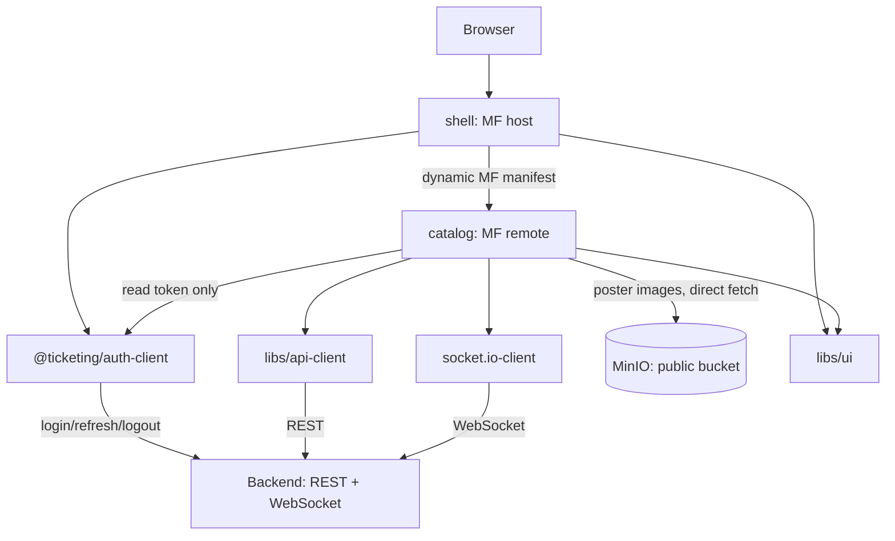

# Frontend System Design — Ticketing Platform (Phase 1: Microfrontends)

## Status

Complete for Phase 1. Written incrementally, section by section, as decisions were discussed and agreed.

**Non-goal:** no frontend testing strategy for Phase 1 — unit/component/e2e tests on the frontend side are explicitly out of scope for now.

## Architecture overview

## 1. Goals and learning priorities

This frontend exists primarily to learn **microfrontends** via Module Federation, on top of the Phase 1 backend described in [`backend-design.md`](./backend-design.md). Everything else on the frontend (React, data fetching) is support for that goal, not the focus itself.

Per [`project-plan.md`](./project-plan.md) §4, the locked tooling choices this design builds on: Nx's Rspack-based Module Federation generators (shell host + remotes) — not hand-wired Vite MF, not Next.js MF — and TanStack Query with a typed client generated from the backend's OpenAPI spec.

Phase 1 ships exactly two federated applications: a `shell` (host) and a `catalog` remote. Cross-MFE communication beyond auth (a shared event bus, shared business state) is deliberately deferred to Phase 6, when a second remote creates a real need for it — designing that now would be guessing at a problem that doesn't exist yet.

## 2. Shell vs remote boundary

The `shell` stays deliberately "thin": its only responsibilities are routing between remotes, the layout shell (header/footer/nav), and bootstrapping the auth context before any remote mounts. It owns no business content — no catalog UI, no domain logic. All of that lives in `catalog` (and in later remotes, as they're added in Phase 6).

This is enforced as a design rule, not just a convention: if a feature decision would add business logic to `shell`, that logic belongs in a remote instead. The reasoning is that the shell is the one piece of the frontend hosting fabric that's expensive to get wrong — it's rarely redeployed, and every remote depends on it being stable. A shell that absorbs business logic over time stops being a hosting shell and becomes just another remote with extra privilege, which defeats the purpose of splitting the frontend into independently deployable pieces in the first place.

**Components inside `shell`:**
- `AppShell` — the root layout (header/footer/content outlet).
- `Header` / `Footer` — nav bar (auth-aware login/logout control), footer.
- `AppRouter` — top-level routing, matching path prefixes to remotes (§5).
- `AuthBootstrap` — on startup, attempts a silent refresh via the httpOnly cookie before rendering any protected content (`system-design.md` §8, A07).
- `LoginPage` / `RegisterPage` — the auth forms, calling `@ticketing/auth-client` (§3).
- `RemoteErrorBoundary` — fallback UI for when a remote (e.g. `catalog`) fails to load.

One explicit exception to "no business content": `shell` owns the login/register pages. No "auth remote" exists or is planned — remotes are `catalog` now, then `checkout/cart`/`account/orders`/`admin dashboard` in Phase 6 — so authentication has to live somewhere in Phase 1, and it isn't `catalog`'s domain. Session/auth is cross-cutting infrastructure needed before any remote mounts, not event-browsing business logic, so it stays in `shell`.

**Components inside `catalog`** (the only remote in Phase 1 — `checkout/cart`, `account/orders`, and `admin dashboard` are added only in Phase 6, `project-plan.md` §5):
- `CatalogRouter` — `catalog`'s own internal routing (`/` list, `/:eventId` details), entirely owned here — `shell` never sees it (§5).
- `EventList` — the event list page, with the debounced filter (§9); renders a list of `EventCard`.
- `EventDetailsPage` — event details + seat map (separate queries, §7); renders `EventInfo`, `SeatMap`, `ReservationPanel`.
- `SeatMap` — the grid of `Seat` components, each memoized (§9/§10).
- `Seat` — one seat: clickable, `aria-label`'d, status shown by color plus icon/text (§10).
- `ReservationPanel` / `ReserveButton` — holds the current seat selection, submits `POST /orders`, shows optimistic UI (§9).
- `useSeatAvailability` — wraps the WebSocket subscription (§8) and writes updates into the TanStack Query cache (§7).
- `EventListSkeleton` / `SeatMapSkeleton` — loading placeholders, from `libs/ui`.

## 3. Auth state across shell and remote

Auth state is **not** passed from shell to remote via React Context through the Module Federation shared scope. That pattern is version-fragile — host and remote must agree on the exact React (and context) instance at runtime, and mismatches fail in ways that are hard to debug across a federation boundary.

Instead, auth/session handling lives in a plain shared library, `@ticketing/auth-client`, published as a Module Federation shared singleton. It exposes:

- `getAccessToken()` — reads the current access token.
- `onAuthChange()` — subscription for login/logout/token-refresh events.
- A fetch/axios interceptor that attaches the access token to outgoing requests and triggers a refresh on 401.

`shell` owns the orchestration — login, logout, and refresh-token rotation (consistent with the token flow in [`backend-design.md`](./backend-design.md) §6) — by calling into `@ticketing/auth-client`. Remotes (`catalog` and later additions) only ever *read* the current token through the same library; they never reimplement refresh logic themselves.

The underlying reasoning: a token is session data, not UI state. Centralizing its handling in one shared library — rather than React state passed across the federation boundary — means the refresh logic can't drift out of sync between shell and remote, and removes the runtime coupling risk that comes with sharing stateful UI primitives like Context across independently-deployed applications.

## 4. OpenAPI-generated API client

Both `shell` and every remote consume a single shared, buildable Nx library — `libs/api-client` — generated directly from the backend's OpenAPI spec. It is not regenerated per-remote.

The generation tool is **Orval**, chosen specifically because it generates TanStack Query hooks directly from the OpenAPI spec (not just raw types), which removes the boilerplate of hand-writing query/mutation hooks around a typed client.

This keeps the API contract in exactly one place in the frontend workspace. When the backend contract changes, regenerating `libs/api-client` is the only step needed — individual remotes don't need separate fixes. This is also what makes backend and frontend implementation tasks realistically parallelizable: both sides build against the same generated contract rather than against each other's in-progress code.

## 5. Routing and local dev topology

`shell` resolves `catalog`'s URL dynamically, via a small JSON manifest it reads at startup in the browser, rather than having that URL hardcoded into `shell`'s build. This means `catalog` can move to a new URL (redeploy, new host) without any rebuild of `shell` — which is what actually makes a remote independently deployable; baking the URL in at compile time would force a `shell` rebuild on every remote move, defeating that purpose.

`shell`'s router only matches a top-level path prefix (e.g. `/catalog/*`) and mounts `catalog`'s root component; everything under that prefix is routed entirely by `catalog`'s own router, lazily loaded via `React.lazy`/`Suspense`. This keeps `shell` from needing to know `catalog`'s route tree, consistent with the "thin shell" rule in §2.

Locally, `nx serve shell` starts `shell` and all configured remotes together via Nx's Module Federation dev-server executor, each on its assigned port (`shell`: 4200, `catalog`: 4201 by default). The `--devRemotes=catalog` flag restricts which remotes run in live-reload dev mode versus serving from their last static build.

## 6. Shared UI / design system

`shell` and every remote consume a single shared Nx library, `libs/ui`, built on shadcn/ui and Tailwind CSS. Components are generated once into `libs/ui` via the shadcn CLI and exposed as a Module Federation shared singleton — never regenerated independently inside `shell` or any remote. Design tokens (colors, spacing, radii) live in one shared Tailwind preset that each app's own `tailwind.config` extends, so the generated utility classes stay in sync across independently-built apps instead of drifting apart over time.

This follows the same pattern already used for `@ticketing/auth-client` (§3) and `libs/api-client` (§4): anything that must stay visually or behaviorally identical across `shell` and remotes lives in exactly one shared library, never duplicated per app.

## 7. Data fetching and state management

Server data goes through TanStack Query, using the hooks Orval generates from the OpenAPI spec (§4). Revisiting an already-fetched page shows cached data immediately while silently refetching in the background (stale-while-revalidate), instead of flashing a loading state every time.

Query keys follow a consistent convention — `['events', filters]`, `['event', id]`, `['event', id, 'seats']` — so a successful reservation can precisely invalidate just that event's seat data rather than the whole cache. Updates arriving over WebSocket (§8) are written directly into the matching query's cache entry via `setQueryData`, not just into local component state, so every consumer of that data (the seat map, an availability counter, etc.) sees the same picture.

Explicit non-goal: no persisted cache across page reloads — there's no offline requirement, so this would be added complexity without a feature that needs it.

Local UI state that never crosses the `shell`↔`catalog` boundary — e.g. which seats are currently selected before submitting a reservation — uses plain React `useState`/`useReducer`, not a dedicated state library. Nothing here needs cross-boundary sharing, so none of the problems a store like Zustand solves actually apply.

## 8. WebSocket consumption

The client is `socket.io-client`, matching the backend's Socket.IO-based gateway (`backend-design.md` §2). The connection lives inside `catalog`, not `shell` — consistent with the thin-shell rule (§2) — and is ordinary application code, not a Module Federation shared singleton, since nothing outside `catalog` ever needs it (unlike `@ticketing/auth-client` or `libs/api-client`, which genuinely cross the shell/remote boundary).

A connection is opened and joins the `event:{id}` room (`backend-design.md` §5) when an event's detail page mounts, and leaves/closes when navigating away, so no stale subscriptions linger. The channel is unauthenticated — seat availability is public data, consistent with `GET /events/:id/seats` also being a public endpoint.

Reconnection relies on Socket.IO's built-in automatic retry. On a successful reconnect, the client re-joins the room (room membership doesn't survive a dropped connection) and triggers a manual refetch of the seat query (§7) to pick up anything missed while disconnected.

## 9. Performance

Full reasoning and capacity estimates live in `system-design.md` §8; this is what's implemented, concretely:

- **LCP**: posters are processed on upload (backend, sharp → WebP, multiple sizes) and served via `srcset`; the poster gets `fetchpriority="high"` and is never lazy-loaded; `preconnect`/`preload` target MinIO's origin; the poster fetch starts in parallel with the event-details data fetch, not after it.
- **INP**: optimistic UI on the "reserve" click; each seat is its own `React.memo`'d component; the event-list filter is debounced (~300ms).
- **CLS**: the poster reserves its space (explicit dimensions/`aspect-ratio`); the seat map shows a same-sized skeleton while loading; fonts are self-hosted and preloaded with a metrically-close fallback; transient UI (hold countdown, toasts) is positioned `fixed`/`absolute`; `shell`'s layout reserves the content area's size before `catalog` loads.
- **Bundle / MFE**: shared dependencies (`React`, `@ticketing/auth-client`, `libs/api-client`, `libs/ui`) are Module Federation `shared: { singleton: true }`; `catalog` code-splits internally (`React.lazy`); bundle size is tracked with `rspack-bundle-analyzer`, ideally in CI; `shell` prefetches `catalog`'s `remoteEntry.js` on its own startup.
- **Perceived performance**: the same skeletons (CLS) and optimistic UI (INP) above, plus a thin top-of-page navigation progress indicator for `shell`↔`catalog` transitions.

## 10. Accessibility

Standard components inherit keyboard navigation, ARIA, and focus handling for free from the Radix primitives under `libs/ui` (§6). The seat map gets the same baseline specifically because it's built from plain SVG/HTML elements rather than Canvas (§9) — each seat is its own focusable element with a meaningful `aria-label` (e.g. "Seat A12, available, $45"), the grid supports keyboard navigation (arrow keys between seats, Enter/Space to select), and status is never conveyed by color alone.

Because availability updates arrive live over WebSocket (§8), a status change also triggers an ARIA live-region announcement — otherwise a screen-reader user never learns a seat just became unavailable.

Explicit non-goal: no formal accessibility audit (axe-core, manual screen-reader testing) — these specific seat-map behaviors are implemented without one.

## 11. Rendering strategy: CSR vs SSR

Client-side rendering, using Nx's standard Module Federation dev-server tooling — not server-side rendering.

Nx does have an SSR path for Module Federation (`NxModuleFederationSSRDevServerPlugin`), but it has no equivalent in Nx's migration path to its newer, officially-supported MF plugins — a maturity signal similar to the one that already ruled out Next.js MF (`project-plan.md` §4). SSR combined with Module Federation also introduces a genuinely harder class of bugs (hydration mismatches between server-rendered HTML and two independently-built, independently-deployed apps), for a gain — faster first paint — that isn't this project's actual learning goal: microfrontends themselves, not SSR mechanics (`project-plan.md` §1).
