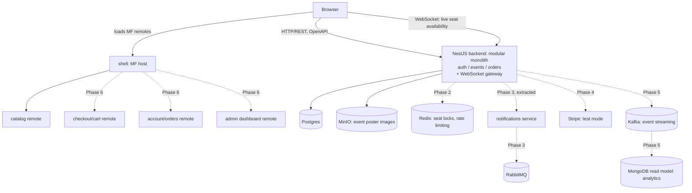

# System Design — Ticketing Platform

## Status

Complete. Top-level system design document, sitting above `backend-design.md`, `frontend-design.md`, and `integration-design.md`. Those documents detail "how" within the boundaries this document sets; this document fixes "what" the product is and the cross-cutting constraints that apply everywhere.

Next: a dedicated consistency pass over `backend-design.md` and `frontend-design.md`, checking each existing decision there against this document — including resolving the one open question below (CSR vs SSR) — before any further detail is added to those subsystem docs.

- [x] Context and scope
- [x] Goals and non-goals
- [x] Functional requirements
- [x] System-context diagram
- [x] Data model
- [x] APIs
- [x] Key flows
- [x] Cross-cutting concerns (performance, security, accessibility, observability)
- [x] Alternatives considered — skipped, not needed
- [x] Degree of constraint
- [x] Open questions

## 1. Context and scope

This is a mini Ticketmaster-style ticketing platform — events, venues, seat booking, orders — built as a learning project, not a commercial product. The domain was chosen specifically because it naturally produces problems (seat-booking concurrency, async order/payment workflows, traffic spikes on popular sales, live seat availability) that justify the backend and frontend tooling being learned, rather than forcing that tooling in artificially. Full background and the phased roadmap live in [`project-plan.md`](./project-plan.md).

## 2. Goals and non-goals

**Goals:**
- Depth in NestJS and backend production patterns (concurrency, async workflows, caching, messaging) on a realistic domain.
- Depth in microfrontends (Module Federation), with the rest of the frontend stack as support.
- A system that behaves like a real production ticketing platform for the scenarios it implements, even though it will never serve real traffic or real payments.

**Non-goals:**
- Not a commercial product — no real users, no real payment processing (Stripe is used in test mode only, in a later phase).
- Not optimized for build speed or minimal scope — depth of learning is prioritized over shipping quickly.
- Not designed to scale beyond what's needed to meaningfully exercise the tools being learned (e.g. Kafka/k6 load testing is about *exercising* the scenario, not about actually surviving real-world traffic).

**Constraint: zero cost.** No paid third-party services or libraries anywhere in the stack. Every piece of infrastructure (Postgres, Redis, RabbitMQ, MinIO, Kafka, the observability stack) is self-hosted via `docker-compose` on the developer's own machine; Stripe is used in test mode only. Features like seat maps are plain data (a `seats` table) rendered with a hand-built UI component, never a licensed third-party product. Every new tool or service considered in later phases is checked against this constraint before being adopted.

## 3. Functional requirements

**Attendee:**
- Register, log in, log out, session refresh.
- Browse the event list, with filters.
- View event details: venue, seat map, availability, price.
- See seat availability update in real time as other attendees reserve seats, without refreshing the page — from Phase 1 (matches the live-availability motivation in `project-plan.md` §2), served over a WebSocket/SSE gateway.
- Select seats and reserve them (a TTL-based hold, no payment) — available from Phase 1, so the seat-concurrency scenario Phase 2 is built around can be exercised through the real UI, not only via direct API calls.
- Pay for a reserved order (Stripe, test mode) — from Phase 4, once the payment saga is built.
- Receive an issued ticket after payment.
- View their own orders and tickets.
- Cancel an order, where its state allows it.

**Organizer:**
- Create and manage a venue (its seat map).
- Create and manage an event (schedule, pricing), including uploading a poster/cover image for it, stored in object storage (MinIO).
- View sales/usage analytics for their own events — from Phase 5, once event streaming and the analytics read model exist.

**Admin:**
- Manage users and roles.
- View an admin dashboard of overall platform activity.

**System (not user-facing):**
- Send notifications (email/push) on order events — from Phase 3.
- Automatically expire unpaid seat holds once their TTL elapses (already specified in `backend-design.md`).
- Stream sales/usage events for analytics — from Phase 5.

Organizer and admin capabilities are backed by the RBAC roles already defined in `backend-design.md` §6 from Phase 1 onward at the API level; their frontend surfaces ship once the corresponding remotes exist, per the phased rollout in `project-plan.md` §5.

## 4. System-context diagram

End-state view of the whole system — every component that will eventually exist, not just what's built today. Solid arrows are connections that exist from Phase 1; dashed arrows are planned, labeled with the phase that adds them.

## 5. Data model

The core entities of the domain, independent of which Postgres schema or service eventually owns each one (that ownership is an implementation detail, fixed in `backend-design.md` §7).

Relationships, in plain terms:

- One **User** can place many **Order**s.
- One **Venue** can host many **Event**s.
- One **Event** has many **Seat**s.
- One **Order** contains many **OrderItem**s (one per reserved seat).
- Each **Seat** is reserved by at most one **OrderItem** at a time.
- Each **OrderItem** results in at most one **Ticket** (only once paid).
- One **Order** can have several **Payment** attempts (e.g. a failed card retried).

- **User** — id, email, role (`attendee` / `organizer` / `admin`).
- **Venue** — id, name, address.
- **Event** — id, venue id, title, start time, poster image reference.
- **Seat** — id, event id, label, status, price.
- **Order** — id, user id, event id, status (`draft` → `reserved` → `paid` → `issued` → `cancelled`), created at.
- **OrderItem** — id, order id, seat id, price. One row per reserved seat.
- **Ticket** — id, order item id, issued at, QR code reference. Created only once an order reaches `issued` — it does not exist in Phase 1, since no payment happens yet.
- **Payment** — id, order id, provider reference (Stripe), amount, status. An order can have more than one payment attempt (e.g. a failed card retried), so this is one-to-many against `Order`, not one-to-one — matching the retry/idempotency handling the Phase 4 payment saga is meant to exercise.

## 6. APIs

- Primary style is REST, documented via Swagger/OpenAPI (`backend-design.md` §1); the frontend never hand-writes a client against it (`frontend-design.md` §4).
- A separate WebSocket channel exists purely for server-pushed live seat-availability updates (§3, §4) — it is not part of the REST surface.
- Every REST error response shares one shape — status, message, error code (`backend-design.md` §5) — across all endpoints, regardless of which module or service produced it.
- REST requests authenticate via a JWT bearer token in the `Authorization` header.
- The API is not versioned (no `/v1/` prefix or equivalent). There is exactly one consumer (the frontend), always kept in sync via the OpenAPI-generated client, so versioning would solve a compatibility problem this project doesn't have.

## 7. Key flows

**Browse → select seat → reserve (happy path, Phase 1)**
1. Attendee opens the site; `shell` loads, then loads the `catalog` remote.
2. `catalog` calls the backend's `events` module to list events, then to fetch one event's details (venue, seat map, availability).
3. Attendee selects a seat and submits a reservation request.
4. The `orders` module creates an `Order` (`draft`) and an `OrderItem` for the seat, calls `EventsApi.reserveSeats()` to mark the seat held, and moves the order to `reserved` with a TTL.
5. The backend returns the hold's expiry time; `catalog` shows a countdown.

**Two attendees race for the last seat (concurrency, Phase 2)**
1. Two attendees, in two browser tabs, both click "reserve" on the same last available seat within milliseconds of each other.
2. Both requests hit the `orders` module at roughly the same time.
3. Both try to acquire a Redis lock on that seat id; only one succeeds, the other's attempt fails immediately.
4. The attendee who got the lock proceeds through the happy-path flow above.
5. The attendee who didn't gets an immediate "seat no longer available" response — not a slow one, and not left waiting.

**Reservation → payment → ticket issuance (async/saga, Phase 4)**
1. Attendee, holding a `reserved` order, submits payment details.
2. Backend charges the order via Stripe (test mode); a `Payment` row is created for the attempt.
3. On success, the order moves to `paid` and a domain event is emitted.
4. A `Ticket` is created for each `OrderItem`, and the order moves to `issued`.
5. The `notifications` service, consuming that event off RabbitMQ, sends a confirmation email.
6. If the payment fails (e.g. a declined card), the order stays `reserved` — the seat hold is still valid until its TTL — and the attendee can retry, producing another `Payment` row for the same order.

**Live seat availability (real-time, Phase 1)**
1. Attendee A reserves a seat, per the happy-path flow.
2. Once the seat is successfully marked held, the backend publishes an update over the WebSocket gateway for that event.
3. Every other attendee currently viewing that event's seat map receives the update over the same channel and sees the seat flip to "held" instantly, without refreshing.

## 8. Cross-cutting concerns

### Performance

**Capacity estimate (hypothetical, used as a design target, not a real traffic promise):** 50,000 registered attendees; one popular event with 2,000 seats whose on-sale moment draws 5,000 reservation attempts within the first minute, front-loaded into a burst of roughly 500–1,000 requests/sec in the first few seconds. About 3,000 of those attempts are necessarily rejected ("seat no longer available") once the 2,000 seats are taken.

**Targets derived from that estimate:**
- The reserve endpoint, under that burst (Redis lock contention included): p95 latency < 300ms — including for the ~3,000 requests that get rejected; a rejection must be fast, not hung.
- Catalog browsing (served from cache): p95 latency < 150ms.
- The Phase 7 k6 load test targets exactly this scenario — ramp to 1,000 virtual users reserving seats for one 2,000-seat event — and asserts both no double-booked seat (correctness) and the latency targets above.

**Caching.** Event listings and event details are cached in Redis (Phase 2) using the cache-aside pattern: the app checks Redis first, and on a miss reads Postgres and populates the cache. Seat availability is never cached — it changes too often, and its real-time delivery is already handled by the WebSocket gateway (§7), not by a read cache. Cache entries are invalidated two ways together: a short TTL as a safety net, and an explicit cache-bust whenever an organizer creates or edits an event, so the organizer sees their own change reflected immediately rather than waiting out the TTL.

**Explicit non-goals:** no CDN (requires a paid/hosted edge network, conflicts with the zero-cost constraint in §2, and there's no real geographically-distributed user base to justify it); no database sharding or read replicas (far beyond the scale in the estimate above); no load balancing across multiple backend instances (out of scope for what this project is trying to learn).

### Database performance

- **Indexes.** Postgres does not auto-index foreign-key columns (only primary/unique keys), so these are added explicitly on the columns actually filtered on: a composite index on `Seat(event_id, status)` (the hot "available seats for event X" query), plus `Order.user_id`, `OrderItem.order_id`, `OrderItem.seat_id`, and `Payment.order_id`.
- **Double-booking protection at the database level.** The Redis lock (§7, Phase 2) is the primary, fast defense against two attendees grabbing the same seat. A unique constraint on `OrderItem.seat_id` (among active order items) is added as a second, independent line of defense — if the lock were ever bypassed by a bug, the database itself still refuses the duplicate write. Relying on the application-level lock alone is not enough.
- **N+1 queries.** Known nested access patterns (e.g. a user's orders together with their order items and seats) always use Prisma's `include` to fetch them in one query via JOIN — never fetched per-item in a loop.
- **Connection pooling.** Phase 1 uses one shared `PrismaClient` and one connection pool for the whole monolith (auth/events/orders together, per the single multiSchema `schema.prisma` in `backend-design.md` §3), sized via an env variable; the default pool size is sufficient at this project's scale. Each service gets its own pool once it's extracted (Phase 3+) — not a concern yet.

### Horizontal scaling and statelessness

Running more than one backend instance at once (multiple containers behind a load balancer — achievable entirely locally via `docker-compose` plus a self-hosted, free reverse proxy like Nginx or Traefik, no paid infrastructure required) exposes a gap: the WebSocket gateway (§7, live seat availability) only broadcasts to clients connected to the same instance that handled the triggering request. An attendee connected to instance B never hears about a reservation handled by instance A.

The fix is the standard production pattern: the Socket.IO Redis adapter (`@socket.io/redis-adapter`). Every instance publishes outgoing WebSocket messages to a Redis pub/sub channel instead of emitting only to its own locally-connected clients; every instance subscribes to that channel and forwards matching messages to its own clients. No sticky sessions are needed — the fix works regardless of which instance a given client happens to be connected to. This reuses the same Redis instance already planned for Phase 2 (locks, rate limiting), not new infrastructure.

The in-process `EventEmitterModule` (`backend-design.md` §4) stays as-is for side effects that only matter within the instance handling the request. Anything another instance or an extracted service needs to react to goes through RabbitMQ once that side effect is extracted (Phase 3), not through the in-process emitter — this was already the plan in `backend-design.md` §4, just confirmed here as the reason it doesn't need the same Redis pub/sub fix as WebSocket.

### Async offloading

Work that doesn't need to finish before the triggering request can respond is moved off the request path and into background processing, rather than making the caller wait on it:

- **Notifications** (email/push after an order event) — already specified as going through RabbitMQ to the extracted `notifications` service (Phase 3), not executed inline.
- **Ticket issuance** (QR code generation and the MinIO upload) — handled asynchronously as a step of the Phase 4 payment saga, not inline in the payment request. The payment request returns "paid" as soon as Stripe confirms the charge; ticket generation happens as a separate, outbox-driven step afterward, and the attendee learns the ticket is ready over the same WebSocket channel used for live seat updates (§7), or simply sees it next time they open their orders. This avoids a slow or temporarily-failing MinIO upload turning a successful payment into a failed request.
- **Analytics events** (Phase 5, Kafka) — published fire-and-forget; the request that triggered them never waits on Kafka.

### Graceful degradation and backpressure

Every outbound call to a dependency (Postgres, Redis, Stripe, MinIO) has an explicit timeout, so a slow dependency fails the call instead of holding resources (a connection, a request slot) indefinitely while waiting — Postgres also enforces its own `statement_timeout` server-side, as a second layer independent of the application's own timeout. Calls to Stripe use an idempotency key, so a retry after a timeout cannot double-charge the same order.

Transient failures of RabbitMQ or MinIO on the already-asynchronous paths (notifications, ticket issuance) don't need special handling beyond queue durability — the message simply waits until the dependency recovers, which falls out of the async design in the section above rather than requiring new logic.

The one case needing an explicit choice is a Redis outage affecting the seat-reservation lock: the reserve endpoint **fails closed** — it rejects new reservation attempts with "try again later" rather than falling back to relying solely on the database's unique constraint (§ Database performance). Seat-booking correctness is the one scenario this whole project's domain was chosen to exercise, so it's treated conservatively: better to temporarily refuse bookings than risk the one guarantee the project is built around.

### Frontend performance

**LCP (Largest Contentful Paint)** — target ≤2.5s. On the catalog page, the largest visible element is the event poster image; LCP is gated by TTFB (already addressed via caching, above) plus however long the poster takes to arrive and render — and, specific to this architecture, by the extra network round-trip needed to fetch `catalog`'s `remoteEntry.js` before any of its content, including the poster, can start rendering (`frontend-design.md` §5).

- Posters are processed on upload (resized, converted to WebP) via a backend image-processing step, rather than stored and served as the raw uploaded file.
- Multiple sizes are generated per poster and served via `srcset`/`sizes`, so a small screen downloads a small file rather than always fetching the largest variant.
- The poster image gets `fetchpriority="high"` and is never lazy-loaded.
- `rel="preconnect"` to MinIO's origin, plus `rel="preload"` for the specific poster URL once known, so the connection is warmed and the fetch starts as early as possible.
- The poster fetch is kicked off in parallel with the event-details data fetch wherever the image URL can be known without waiting for that request to resolve (e.g. a predictable URL pattern from the event id in the route) — avoiding a waterfall where the image request only starts after the data request finishes.
- Uploaded posters get long-lived `Cache-Control` headers, since they rarely change once set — a repeat visit doesn't re-download them.
- Compression (Brotli/Gzip) and HTTP/2 are enabled at the reverse-proxy layer (the same Nginx/Traefik already used for load balancing, § Horizontal scaling) — configuration, not application code.

Whether the frontend is client-rendered or server-rendered is still open — see §11, Open questions — and materially affects what's achievable here; this section assumes whichever choice is made there, without presupposing it.

**INP (Interaction to Next Paint)** — target ≤200ms. Measures how long it takes for the screen to visually react to an interaction (a click, a tap), not how long the server takes to respond.

- The "reserve" button's pending/disabled state renders synchronously on click (optimistic UI), rather than waiting on the network round-trip before showing any visual feedback.
- Each seat in the seat map is its own memoized component (`React.memo`), so selecting or updating one seat re-renders only that seat — not the full map of up to a few thousand seats.
- The event-list filter/search input is debounced (e.g. ~300ms), so fast typing doesn't trigger a cascade of heavy re-filtering on every keystroke.

**CLS (Cumulative Layout Shift)** — target ≤0.1. Measures how much visible content shifts position unexpectedly while the page loads.

- The poster image reserves its space (explicit `width`/`height` or CSS `aspect-ratio`) matching whichever `srcset` size loads, instead of collapsing to zero height until the image arrives.
- The seat map renders a same-sized skeleton while event/seat data is loading, so its appearance doesn't shift the rest of the page — the same skeleton already planned for perceived performance (below) doing double duty here.
- Fonts are self-hosted (not loaded from Google Fonts' CDN at request time) and preloaded, with a fallback font chosen to be metrically close, so swapping from fallback to the real font doesn't visibly reflow text.
- Transient UI (the seat-hold countdown, error/success toasts) is positioned `fixed`/`absolute`, never inserted inline into the normal layout flow, so showing or dismissing it never shifts surrounding content.
- `shell`'s layout shell (header/footer/nav plus the content area, `frontend-design.md` §2) already defines the content area's size and position before `catalog` finishes loading, so mounting the remote into it doesn't shift the surrounding layout.

**Bundle size and MFE-specific loading cost**

- Shared dependencies (React, `@ticketing/auth-client`, `libs/api-client`, the `libs/ui` component library — `frontend-design.md` §3/§4/§6) are configured as Module Federation `shared: { singleton: true }`, so they load exactly once across `shell` and `catalog`, never duplicated per app.
- Code-splitting within `catalog` itself (`React.lazy`) — e.g. organizer/admin-only views aren't shipped to an attendee who never sees them.
- Heavy dependencies are avoided where a lighter alternative exists (e.g. `date-fns` with modular imports instead of `moment.js`).
- Bundle size is tracked with a bundle analyzer, ideally wired into CI, to catch size regressions over time rather than optimizing only once.
- `shell` prefetches `catalog`'s `remoteEntry.js` as soon as it itself starts, instead of waiting until the router actually navigates there — softening the extra network hop noted under LCP.

**Perceived performance**

- Skeleton loaders for the event list, event details, and seat map while their data loads — the same skeletons already introduced for CLS, doing double duty here.
- Optimistic UI on the "reserve" button (already covered under INP).
- A thin top-of-page navigation progress indicator for transitions between `shell` and `catalog` routes, so a navigation feels immediate even while the target remote is still loading.

**Client-side caching (TanStack Query)**

- Stale-while-revalidate: revisiting an already-fetched catalog page shows the cached data immediately while silently refetching in the background, instead of flashing a loading state every time.
- Consistent query keys (`['events', filters]`, `['event', id, 'seats']`) so a successful reservation can precisely invalidate just that event's seat data, and so a WebSocket update (§7) writes directly into the TanStack Query cache (`setQueryData`) rather than only into local component state — keeping every consumer of that data in sync.
- Explicit non-goal: no persisted cache across page reloads — there's no offline requirement, so this would be added complexity without a feature that needs it.

### Security

Checked against OWASP Top 10:2025.

**A01 — Broken Access Control.** Authorization is always checked server-side, never trusted from the UI alone. Role checks (`backend-design.md` §6) cover who can create events/venues; ownership checks (only an order's owner can view/cancel it) cover per-resource access — knowing a resource's id is never enough to access it (guards against IDOR).

**A02-A03-A05 — hygiene.** No default credentials anywhere, even locally; admin UIs (RabbitMQ, MinIO consoles) bind to localhost only; CORS allows only the known frontend origin; `pnpm` lockfile committed, Dependabot enabled on GitHub; Prisma parameterizes all queries, so SQL injection isn't a realistic risk as long as raw queries are never string-concatenated.

**A04 — Cryptographic failures.** Passwords hashed with argon2id. JWTs signed with HS256 — fine while one service both issues and verifies them; revisit (RS256) only if a future extracted service needs to verify independently.

**A06 — Insecure design.** Already addressed elsewhere: Redis lock + DB unique constraint against double-booking, rate limiting on reservation, TTL on holds. Explicit non-goal: bot/scalper detection.

**A07 — Authentication failures.** Access token in memory only (never persisted); refresh token in an httpOnly/Secure/SameSite cookie, unreadable by JS — closes the XSS-theft risk plain `localStorage` would have. Consistent with `@ticketing/auth-client` (`frontend-design.md` §3): `getAccessToken()` just returns the in-memory value.

**A08 — Integrity failures.** Stripe webhooks are verified by signature (Stripe's signing secret) before being trusted — otherwise anyone could POST a forged "payment succeeded" event.

**A09 — Security logging.** Failed logins and access denials (403s) are logged distinctly from normal request logs; storage/retention details are covered under Observability, below.

**A10 — Exceptional conditions.** The global exception filter (`backend-design.md` §5) never returns stack traces or internal error details to the client — only the normalized error shape.

### Accessibility

Standard components inherit keyboard navigation, ARIA, and focus handling for free from the Radix primitives under `libs/ui` (shadcn/ui, `frontend-design.md` §6). The seat map is the one non-trivial case, since it isn't a standard component: each seat needs a meaningful `aria-label` (e.g. "Seat A12, available, $45"), the grid needs explicit keyboard navigation (arrow keys between seats, Enter/Space to select — not available by default on a grid of divs), and seat status (available/held/booked) is never conveyed by color alone. Because availability updates live over WebSocket (§7), a status change also needs an ARIA live-region announcement, or screen-reader users never learn a seat just became unavailable. Explicit non-goal: no formal accessibility audit (axe-core, manual screen-reader testing) — these specific seat-map behaviors are implemented without one.

### Observability

The full stack (OpenTelemetry, Prometheus, Grafana, Loki, Jaeger — logs, metrics, and traces) arrives in Phase 7 (`project-plan.md` §4); nothing new decided there.

Worth doing from Phase 1, ahead of that stack: structured (JSON) logs rather than plain text, so Loki/Grafana can parse them without rework later; a correlation/request id attached to every log line for the duration of a request, cheap to add now via middleware and already useful for debugging before any aggregation tooling exists; and security-relevant log lines (§ Security, A09) carrying a distinguishing field (e.g. `event: "auth.login_failed"`) so they're filterable/alertable once Grafana exists — alerting itself stays a Phase 7 non-goal, only the log shape is prepared now.

## 10. Degree of constraint

**Hard constraints** — not to be silently violated by `backend-design.md`, `frontend-design.md`, or the code, without revisiting this document first: the zero-cost rule (§2), the Phase 1 functional scope and its explicit non-goals (§3), and the shape of the data model (§5).

**Soft guidance** — can be adjusted during implementation without that counting as a deviation: the specific numbers in § Performance (explicitly a hypothetical estimate, not a promise — real k6 measurements may justify different targets); specific library choices for small implementation details (e.g. which debounce helper) where the underlying principle, not the library, is what's fixed.

## 11. Open questions

- ~~**CSR vs SSR for the frontend.**~~ Resolved: CSR. See `frontend-design.md` §11.
